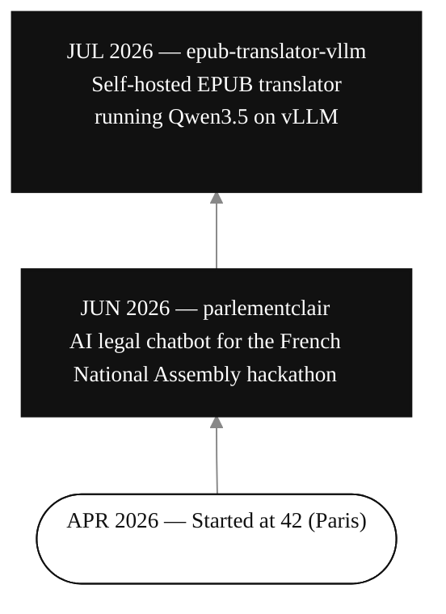

- **[parlementclair](https://github.com/tdi-rosa/parlementclair)** — AI legal chatbot (hackathon Assemblée nationale)
- **[epub-translator-vllm](https://github.com/tdi-rosa/epub-translator-vllm)** — traducteur EPUB self-hosted, Qwen3.5 sur vLLM
