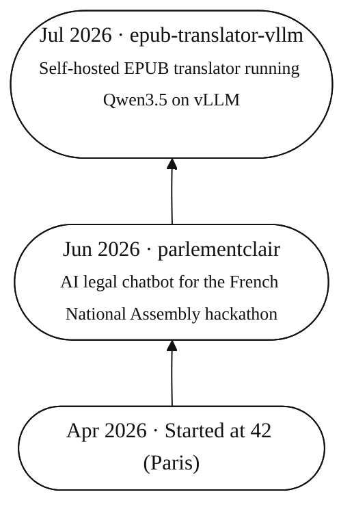

```mermaid
%%{init: {"theme": "base", "themeVariables": {
    "primaryColor": "#ffffff",
    "primaryTextColor": "#111111",
    "primaryBorderColor": "#111111",
    "lineColor": "#111111",
    "secondaryColor": "#ffffff",
    "tertiaryColor": "#ffffff",
    "fontFamily": "Helvetica, Arial, sans-serif"
}}}%%
flowchart BT
    A(["Apr 2026 · Started at 42 (Paris)"])
    B(["Jun 2026 · parlementclair<br/><small>AI legal chatbot for the French National Assembly hackathon</small>"])
    C(["Jul 2026 · epub-translator-vllm<br/><small>Self-hosted EPUB translator running Qwen3.5 on vLLM</small>"])

    A --> B --> C

    click B "https://github.com/tdi-rosa/parlementclair" _blank
    click C "https://github.com/tdi-rosa/epub-translator-vllm" _blank
```
