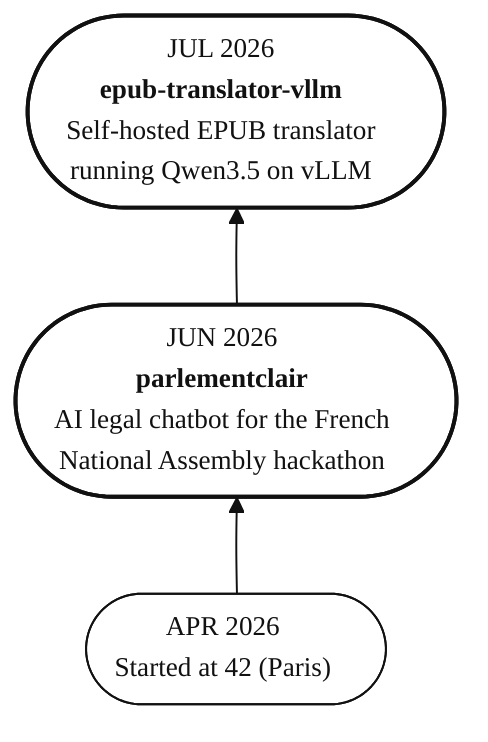

```mermaid
%%{init: {
  "theme": "base",
  "themeVariables": {
    "primaryColor": "#ffffff",
    "primaryTextColor": "#111111",
    "primaryBorderColor": "#111111",
    "lineColor": "#111111",
    "fontFamily": "-apple-system, BlinkMacSystemFont, Helvetica, Arial, sans-serif",
    "fontSize": "14px"
  },
  "flowchart": { "curve": "basis", "htmlLabels": true }
}}%%
flowchart BT
    A(["APR 2026<br/>Started at 42 (Paris)"])
    B(["JUN 2026<br/><b>parlementclair</b><br/>AI legal chatbot for the French<br/>National Assembly hackathon"])
    C(["JUL 2026<br/><b>epub-translator-vllm</b><br/>Self-hosted EPUB translator<br/>running Qwen3.5 on vLLM"])

    A --> B --> C

    class A milestone
    class B,C project

    classDef milestone fill:#ffffff,stroke:#111111,stroke-width:1px,color:#111111;
    classDef project fill:#ffffff,stroke:#111111,stroke-width:2px,color:#111111;

    click B "https://github.com/tdi-rosa/parlementclair" _blank
    click C "https://github.com/tdi-rosa/epub-translator-vllm" _blank
```
